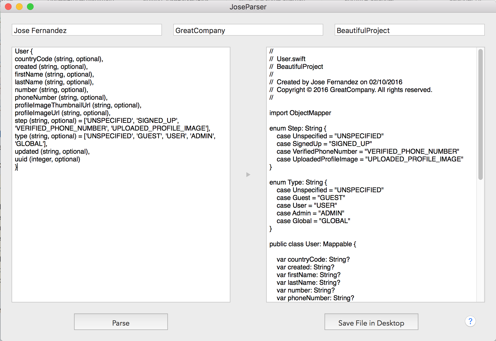

# Rosetta

 .middle[Rosetta is a Mac app created on my own to save tons of time while working in my current company by automatically parsing the class models we need from Swagger.io.]

## Why?
In our company we use to work with Swagger.io. I was always finding myself over and over again by tediuosly copying and pasting the models from the online documentation just to generate our own model classes in Swift. It was a really heavy task and we were losing tons of time just by doing the same task. So I thought that could be made in an automatic way, therefore I decided to create this Mac OS app which generates the classes we need on its own.

## How it works
Basically you only need to paste the model class from Swagger.io in the left text view and it will automatically create the Swift model class for you in the right one. Then you can review the generated code and correct it in case you spot any error. Finally there's a button which saves your class file in the desktop.
Keep in mind that I have adapted the resulting code specifically to our company and way of work, so we have 100% fully ready and integrated classes for our projects to save time. Ah!, it also maps the enum values and creates the enumerations for you.

## That's all?
I have in mind a lot of improvements for this app, like:
- Change the behaviour so you only need to setup the url of the API docs, the client id and client secret and it will automatically detect and parse all the class models and generate all the class files for you. I have been researching about Swagger tools and it seems  that 'Swagger Codegen' could help with that, but I need some time for that.
- Allow to set the project path so the files are automatically created there.
- Improve massively the quality of the code. I made the app as a quick solution in a couple of days so needs lots of refactoring and improvements. Also needs to be robust and ready for Swift 3.0.
- Adapt it to other API docs services and frameworks (JSONDoc, Mashery, RestKit, etc).

Please feel free to write any comments, pull requests, forks, etc!

## Release Notes

0.2
- Changed name of the app and icon with inspiration from Rosetta Stone.
- Added preferences screen where you can set the number of spaces for indentation, toggle the header comments and the mapping service (currently working with manual mapping and objectmapper).
- Slightly refactoring and cleaning code.
- Added support for manual mapping.

## In next versions

0.3
- Clean code and refactoring.
- Unit Testing.
- Error handling.
- Handling mapping of dictionaries inside the main model, e.g. 'prices' dictionary (currency, amount, divisor) inside 'clothes' model.

0.4
- Clean code and refactoring.
- Unit Testing.
- Possibility to create the mapping classes as structs.
- Onboarding/tutorial/help.

0.5
- Clean code and refactoring.
- Unit Testing.
- Add support for SwiftyJSON.
